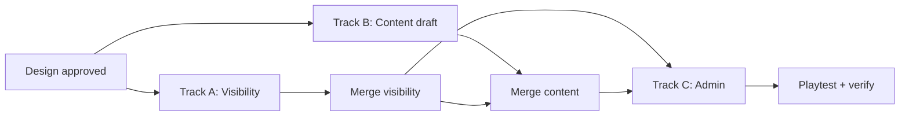

# Rumor Visibility + Authoring — Design Spec

> Make rumor chains impossible to miss when they fire, narratively satisfying when pursued, and editable without touching TypeScript or raw JSON.

**Status:** Approved (design decisions locked — see §8)  
**Prerequisite:** M2 rumor engine (shipped)  
**Downstream:** Two parallel implementation tracks (see §7)

---

## 1. Problem

The rumor **engine** works; the rumor **experience** does not. Playtests suggest players finish runs without knowing rumors exist, or discover one and never recognize step progression.

### Root causes (verified in code)

| Gap | What happens today |
|-----|-------------------|
| **Discovery is a needle in a haystack** | Only 4 of 116+ encounters grant `discoversRumor`, on a specific choice with no UI callout. Easy to pick "Move on quietly" and never know. |
| **No first-rumor tutorial** | Design spec requires a "Press J" hint on first discovery. `hints.ts` never implemented it. |
| **Journal is opt-in and hidden** | Panel starts hidden; no HUD badge when rumors are active. |
| **Rumor steps look like normal encounters** | Encounter view header is always `"Encounter"`. No chain title, no step counter. |
| **Silent progression** | Discovering a rumor logs `A new lead: "Title"`. Completing a step or chain updates state with **no log message**. |
| **Hints are tag keywords, not story** | Journal shows `"Seek ruined masonry where underground channels still run."` — reads like a dev note, not a quest beat. |
| **Step 0 often duplicates discovery terrain** | Whispering Well discovers on `water+ancient` forest; step 0 requires the same tags. Feels like the same encounter twice, not a chain starting. |
| **Authoring split across code + DB** | Chain structure in `rumors.ts`, step encounters in Turso/seed JSON, no validation that IDs link up. Target: both in Turso. |

### Success criteria

A friends-and-family playtester should be able to answer **yes** to all of:

1. "I knew when I found a rumor."
2. "I knew I was on a rumor step (not a random encounter)."
3. "I knew when I advanced or finished a chain."
4. "The journal told me what to do next in plain language."

---

## 2. Design goals

1. **Noticeability first** — visibility and framing changes before content volume.
2. **Narrative chain, not tag hunt** — steps connect in text; hints describe places and images, not tag names.
3. **Terminal aesthetic preserved** — ASCII framing, monospace, muted palette (see ADD.md).
4. **Authoring in one place** — encounters and rumor chains both editable from admin, both backed by Turso.
5. **Pure engine stays pure** — visibility metadata passed through `GameState` / `GameMode`, not inferred in renderer from DOM.

---

## 3. Player-facing changes (Track A — engine + UI)

These are **mechanical visibility fixes**. They make existing content noticeable; they do not replace content rewrites.

### 3.1 Global discovery weight boost

**MUST:** While the player has **zero** active or completed rumors, hex generation applies a global weight boost to encounters that contain a `discoversRumor` choice.

- Boost magnitude: **3×** encounter selection weight for eligible encounters (tune in M4-style playtest pass).
- Boost turns off permanently once the player discovers their first rumor (active or completed counts).
- No forced probe hex — discovery remains organic but much more likely early.

Dedicated `*-discovery` encounters (§4.3) are added to the pool so boosted rolls have strong targets.

### 3.2 Encounter framing for rumor steps

When `resolveTurn` enters a rumor step encounter, `GameMode.encounter` MUST carry rumor context:

```typescript
interface EncounterMode {
  type: "encounter";
  encounter: Encounter;
  hex: CubeCoord;
  rumorContext?: {
    rumorId: string;
    rumorTitle: string;
    stepIndex: number;      // 0-based
    stepCount: number;
    isFinalStep: boolean;
  };
}
```

**Encounter view changes:**

- Header: `Rumor — The Whispering Well` (not generic `"Encounter"`)
- Subheader: `Part 2 of 4`
- Optional: distinct border glyph line (`─ ═ ─`) in rumor color (`#da4` amber per ADD)

Discovery encounters (first hook before chain is active) use header `A Lead Surfaces` — no step counter.

### 3.3 Log + journal feedback

**New log entry types** (styled in `log.ts`):

| Event | Example text | Style class |
|-------|--------------|-------------|
| Rumor discovered | `▸ Lead recorded: "The Whispering Well" — press J to read your journal` | `log-rumor` |
| Step advanced | `▸ Whispering Well — the trail deepens. Check your journal.` | `log-rumor` |
| Chain completed | `▸ Whispering Well resolved. You claim the Well Sigil.` | `log-rumor` + resource line |

**MUST NOT:** Auto-open the journal on discovery. Player opts in via J key.

**MUST:** Add `first-rumor` to `HintId` in `hints.ts` — `"Press J for your journal — a new lead awaits"`. Dismisses when player opens journal or discovers a second rumor.

### 3.4 HUD indicator

**MUST:** When `rumors.active.length > 0`, show in legend or HUD:

```
◆ 1 active lead
```

Updates count if multiple active. Uses amber (`#da4`), not a new color.

### 3.5 Choice callouts at discovery

When a choice has `discoversRumor`, encounter view appends to the choice line:

```
1. Trace the spiral  →  +1 hope  [reveals a lead]
```

No spoiler of rumor title until chosen.

### 3.6 Step advancement log (engine)

In `handleChoose`, after `checkRumorAdvancement`:

- If step advanced but not complete: append step-advanced log with rumor title.
- If complete: append completion log + relic name if any.

Currently this path is silent — **this is likely the biggest "I didn't notice" bug**.

---

## 4. Content changes (Track B — Claude drafting)

Track A can ship with existing copy. Track B rewrites and extends content against the schema below.

### 4.1 Chain structure

**Target:** **5 fresh chains** × 4–5 steps each. Replace existing 4 chains entirely (new IDs, new narrative, new discovery encounters).

Each chain MUST have:

| Field | Purpose |
|-------|---------|
| `title` | Player-facing name |
| `premise` | 1–2 sentence hook shown at discovery (journal + log) |
| `steps[]` | Ordered steps |
| `reward` | Relic ref |
| `hopeBonus` | Completion bonus |

Each step MUST have:

| Field | Purpose |
|-------|---------|
| `encounterId` | Links to encounter data |
| `journalHint` | Player-facing next objective in plain language (no raw tag names) |
| `hintTags` / `hintBiomes` | Engine weighting only — never shown to player |
| `stepTitle` | Short label for log lines, e.g. `"The Buried Conduit"` |

### 4.2 Narrative rules for content author

1. **Discovery encounter** — Sets up the mystery. Primary choice grants rumor. Text must stand alone; no prior context needed.
2. **Step 1** — Pays off discovery; references what the player learned. Different biome/tags from discovery where possible.
3. **Middle steps** — Escalation. Each step's opening sentence references the previous location or object.
4. **Final step** — Payoff scene. Choices offer hope/supply but completion is automatic on any resolution (existing engine behavior).
5. **Journal hints** — Write as imperative travel directions: *"Follow the sound of water under broken arches in the ruins."* Never: *"Seek stone + water in ruins biome."*

### 4.3 Discovery encounter pool

**MUST:** Each chain has a dedicated `*-discovery` encounter (not shared with generic 2-tag pool).

**SHOULD:** 1–2 "wild card" discoveries in the generic pool for replay variety — max 2 per run via engine flag.

### 4.4 Content deliverable format

Claude content agent outputs **two files** (no code):

```
content/rumors-draft.json      # chain definitions per §4.1 schema
content/encounters-draft.json  # all linked encounter bodies
```

Integrator (human or agent) validates IDs, runs seed tests, loads into Turso via seed endpoint or admin import. Bundled seed files in git remain backup/dev fallback (same pattern as encounters).

### 4.5 Voice reference

Terminal fantasy. Restrained, concrete, second-person present. Match existing strong encounters (e.g. shadow variants). Read `docs/ADD.md` + 3–5 exemplar encounters from `seed-encounters.json` before writing.

---

## 5. Data model extensions

Extend `Rumor` / `RumorStep` in `state.ts`:

```typescript
interface Rumor {
  id: string;
  title: string;
  premise: string;           // NEW
  steps: RumorStep[];
  reward: Relic | null;
  hopeBonus: number;
}

interface RumorStep {
  stepIndex: number;
  stepTitle: string;         // NEW
  encounterId: string;
  journalHint: string;       // renamed from `hint` — player-facing only
  hintTags: string[];        // engine-only
  hintBiomes?: Biome[];      // engine-only
}
```

Migration: `hint` → `journalHint`, add defaults for `premise` / `stepTitle` so old saves deserialize.

### 5.1 Turso storage (rumors)

Rumor chains live in Turso alongside encounters — same runtime pattern, same admin auth model. The initial 5 chains are a starting set, not a fixed cap.

**Table: `rumors`**

```sql
CREATE TABLE IF NOT EXISTS rumors (
  id TEXT PRIMARY KEY,
  title TEXT NOT NULL,
  premise TEXT NOT NULL DEFAULT '',
  steps TEXT NOT NULL,           -- JSON array of RumorStep
  reward_id TEXT,                -- relic id reference (nullable)
  hope_bonus INTEGER NOT NULL DEFAULT 0,
  created_at TEXT NOT NULL DEFAULT (datetime('now')),
  updated_at TEXT NOT NULL DEFAULT (datetime('now'))
);
```

**API routes** (mirror encounters):

| Method | Path | Auth | Purpose |
|--------|------|------|---------|
| GET | `/api/rumors` | Public | List all chains (game startup + admin) |
| POST | `/api/rumors` | API key | Create chain |
| GET | `/api/rumors/[id]` | Public | Single chain |
| PUT | `/api/rumors/[id]` | API key | Update chain |
| DELETE | `/api/rumors/[id]` | API key | Delete chain |

**Client fetch** — new `src/api/rumors.ts`, same pattern as `encounters.ts`:

- Fetch `/api/rumors` at game startup
- Cache in memory
- Fall back to bundled `src/engine/data/rumors-seed.json` when API unavailable (local dev / offline)

**Seed / backup:**

- `src/engine/data/rumors-seed.json` — git canonical backup, same role as `seed-encounters.json`
- `POST /api/seed-rumors` (or extend `/api/seed`) — `INSERT OR IGNORE` from seed file
- Remove hardcoded `ALL_RUMORS` from `rumors.ts`; delete file after migration

**Relic resolution:** `reward_id` stored in Turso; game resolves to full `Relic` object from bundled `relics.ts` at load time (relics stay code-defined until a future pass).

---

## 6. Admin authoring (Track C — Composer tooling)

**Depends on:** §5 schema stable + §5.1 rumors API. Can start UI scaffolding in parallel; wire-up after API lands.

### 6.1 Content architecture (decided)

**Encounters and rumor chains both live in Turso.** One admin panel, one editing workflow, one runtime fetch pattern.

| Content | Runtime source | Git backup | Admin workflow |
|---------|---------------|------------|----------------|
| **Encounters** | Turso `/api/encounters` | `seed-encounters.json` | Edit → save to Turso (live). Export/import JSON for bulk ops. |
| **Rumor chains** | Turso `/api/rumors` | `rumors-seed.json` | Edit → save to Turso (live). Export/import JSON for bulk ops. |
| **Relics** | Bundled `relics.ts` | Same | Read-only picker in admin; `reward_id` on rumors references relic ids. |

**Why both in Turso:**

- Chain count will grow beyond the initial 5 — rumors are content, not config.
- Same CRUD/auth/export patterns you already have for encounters.
- Live edits without redeploy (game refetches on new session).
- Admin can validate cross-references (encounter IDs, `discoversRumor` ids) against the same DB.

**Deploy / dev flow:**

1. Edit encounters or rumors in admin → saved to Turso immediately.
2. Export JSON periodically → commit seed files to git (backup + fresh environment bootstrap).
3. New environment / drift recovery: run seed endpoints to load from git → Turso.

JSON export/import is for **backup, bulk authoring, and Claude content handoff** — not the primary storage path. You edit in admin; Turso is source of truth at runtime.

### 6.2 Scope

| Feature | Priority |
|---------|----------|
| Rumors Turso table + CRUD API (`/api/rumors`) | P0 |
| Client `fetchRumors()` with seed fallback | P0 |
| Structured choice editor (label, outcomes, chance, discoversRumor dropdown) | P0 |
| Rumor chain editor (steps, hints, encounter ID picker) | P0 |
| Encounter search/filter by id, tags, text | P0 |
| Cross-reference validation (orphan encounter IDs, broken discoversRumor) | P0 |
| Rumor + encounter JSON import/export | P0 |
| Relic picker for chain rewards (`reward_id`) | P1 |
| Terminal-aesthetic admin skin matching game | P1 |

### 6.3 Non-goals (this pass)

- WYSIWYG narrative editor
- In-browser playtest simulation
- Multi-user auth beyond existing API key

### 6.4 UX principles

- No raw JSON textareas for choices
- Save in place (no full page rebuild)
- Validation errors inline before POST
- Preview panel: show encounter text + rumor step context side by side

---

## 7. Multi-agent workflow

### Roles

| Agent | Model | Owns |
|-------|-------|------|
| **Lead** (you + this session) | — | Design approval, merge order, acceptance |
| **Visibility** | Composer (Cursor) | Track A — `engine/`, `renderer/`, `ui/log`, `ui/hints`, tests |
| **Content** | Claude (Sonnet/Opus) | Track B — `content/*.json` drafts only |
| **Admin** | Composer (Cursor) | Track C — `api/rumors/`, `src/api/rumors.ts`, `src/ui/admin.ts`, tests |

### Branch strategy

```
main
 └── feat/rumor-visibility          ← Track A (player-facing fixes + schema)
      ├── feat/rumor-api            ← Turso rumors API + fetchRumors (can parallel A)
      ├── feat/rumor-content        ← Track B: seed Turso via draft JSON
      └── feat/admin-authoring      ← Track C: admin UI (after API)
```

Track B content drafts can start immediately against §4 schema. Integration requires §5.1 API (seed/import into Turso).

Track C needs rumors API + encounter admin refactor on the same branch or stacked PRs.

### Handoff contracts

**To Content agent (Claude)** — paste this block into a Claude Code session:

```
Read docs/design/rumor-visibility-and-authoring.md §4 and docs/ADD.md.
Draft 5 rumor chains (4–5 steps each) + all linked encounters.
Output ONLY:
  content/rumors-draft.json
  content/encounters-draft.json
Follow the schema in §4.1. Do not write TypeScript.
Validate: every encounterId exists, every discoversRumor id matches a chain,
discovery encounters are separate from step encounters.
Integrator loads both files into Turso via seed/import — do not commit to rumors.ts.
```

**To Visibility agent (Composer)** — paste into Cursor:

```
Implement docs/design/rumor-visibility-and-authoring.md §3 and §5.
Branch: feat/rumor-visibility
Test-first for engine log messages and rumorContext on GameMode.
Do not modify seed encounter text yet.
```

**To Admin agent (Composer)** — paste after rumors API merges:

```
Implement docs/design/rumor-visibility-and-authoring.md §6.
Branch: feat/admin-authoring
Includes: /api/rumors CRUD if not done, fetchRumors client, admin rumor chain editor,
structured choice editor, cross-reference validation.
Match terminal aesthetic from ADD.md.
```

### Sequencing



### Verification

Use project `/verify` skill before each merge:

- Track A: tests for log entries, `rumorContext` on mode, first-rumor hint, discovery weight boost
- Track B: `seed-data.test.ts` extended for new schema + ID crossrefs; rumors seeded to Turso
- Track C: API route tests for `/api/rumors`, manual admin CRUD, reference validation

---

## 8. Design decisions (locked)

| Question | Decision |
|----------|----------|
| Auto-open journal on discovery? | **No** — hint-only (`first-rumor` in hints.ts) |
| Early rumor discovery? | **Global weight boost** until first rumor found (no forced probe hex) |
| Chain content? | **5 fresh chains** — replace existing 4 entirely |
| Rumors storage / admin? | **Turso** (`/api/rumors`) — same as encounters. Git seed file (`rumors-seed.json`) for backup/bootstrap only. Initial content: 5 fresh chains. |

---

## 9. Out of scope

- Map markers / waypoints for rumor targets
- Branching rumor paths (multiple endings per chain)
- Multiplayer or shared rumor state
